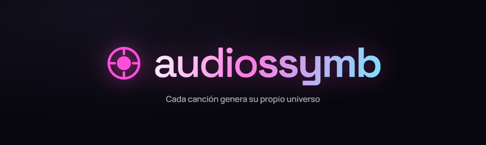
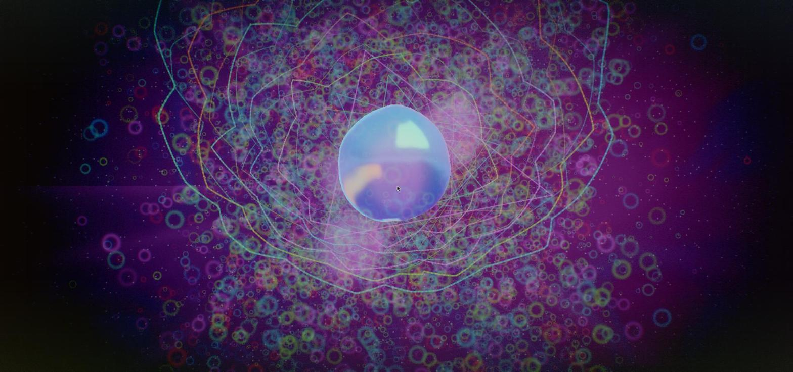
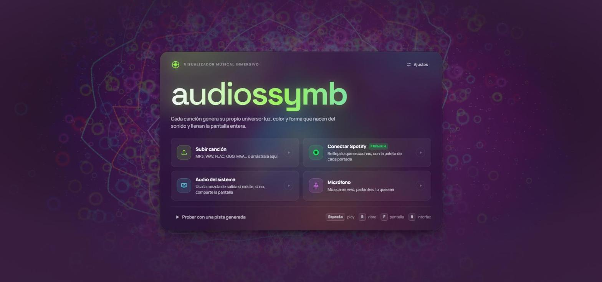
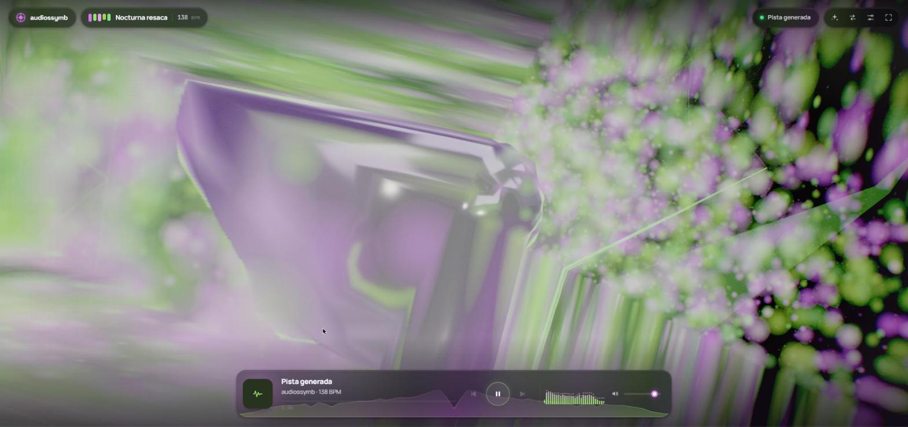
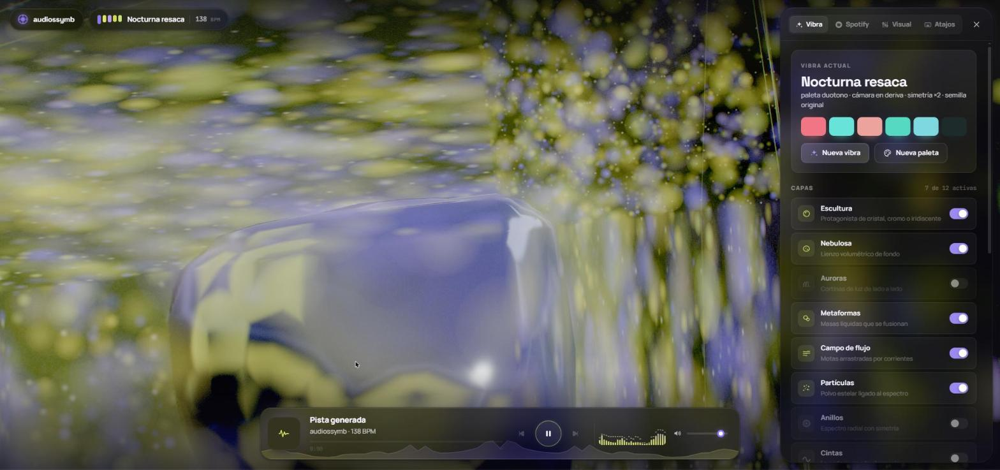
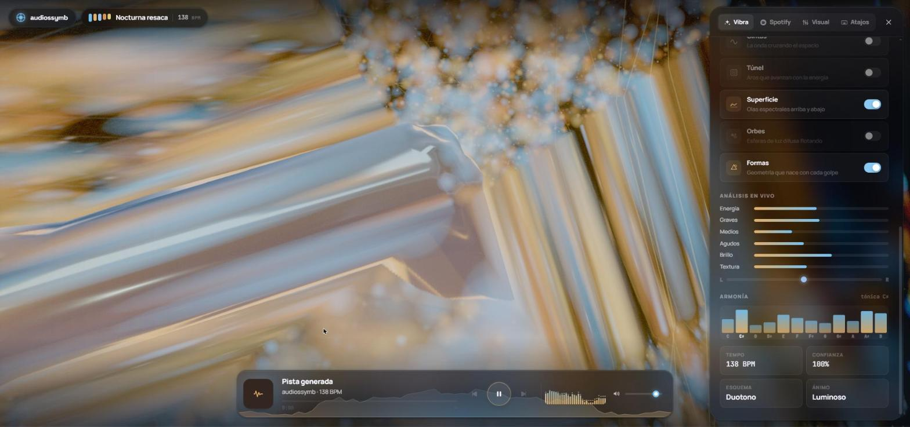
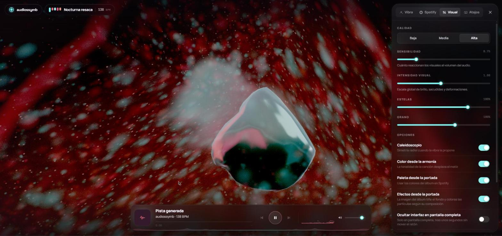

<p align="center">
  
</p>

<p align="center">
  <strong>Visualizador musical inmersivo que corre entero en el navegador.</strong><br>
  Sube una canción o conecta Spotify y mira cómo la luz, el color y la forma nacen de lo que suena.
</p>

<p align="center">
  
  
  
  
  
</p>

---

Cada canción genera su propia **vibra**: una combinación aleatoria —pero determinista por
canción— de capas visuales, paleta, movimiento de cámara y post-procesado, que después se
modula en tiempo real con el análisis del audio. La interfaz forma parte del instrumento:
colores, bordes y sombras respiran con la música, y el color de la escena desborda hacia los
bordes del monitor.

No hay servidor, ni assets que compilar, ni dependencias más allá de three.js. Todo el análisis
de audio y todo el render ocurren en tu máquina.

<p align="center">
  
</p>

## Índice

- [Arranque](#arranque)
- [Fuentes de sonido](#fuentes-de-sonido)
- [Qué hace](#qué-hace)
  - [El motor de audio](#el-motor-de-audio)
  - [Las capas visuales](#las-capas-visuales)
  - [Materiales y luz](#materiales-y-luz)
  - [Post-procesado](#post-procesado)
  - [La portada en la escena](#la-portada-en-la-escena)
- [Capturas](#capturas)
- [Conectar Spotify](#conectar-spotify)
- [Atajos](#atajos)
- [Ajustes](#ajustes)
- [La vibra se queda](#la-vibra-se-queda)
- [Arquitectura](#arquitectura)
- [Requisitos](#requisitos)
- [Contribuir](#contribuir)
- [Licencia](#licencia)

## Arranque

```bash
git clone https://github.com/alenj0x1/audiossymb.git
cd audiossymb
npm install
npm run dev
```

Abre **http://127.0.0.1:5173/**. Usa esa IP y no `localhost`: Spotify exige URIs de redirección
con IP de loopback.

```bash
npm run build     # bundle de producción en dist/
npm run preview   # sirve dist/ para comprobarlo
```

## Fuentes de sonido

| Fuente | Cómo | Análisis |
| --- | --- | --- |
| **Subir canción** | Botón o arrastrar un MP3/WAV/FLAC/OGG/M4A sobre la ventana | Completo |
| **Audio del sistema** | Mezcla de salida si existe; si no, compartir pantalla con audio | Completo |
| **Micrófono** | Permiso de micrófono | Completo |
| **Spotify** | Cuenta Premium + Client ID | Metadatos, portada y controles ([ver detalle](#que-los-visuales-sigan-el-sonido-real-de-spotify)) |
| **Pista generada** | Enlace inferior de la pantalla inicial | Completo (sintetizada en el navegador) |

Cuando **no hay ninguna fuente enchufada** —o hay Spotify sin captura ni análisis— la escena
no se queda quieta: se sintetiza un juego completo de características (espectro, onda, pulso a
96 BPM y un acorde que rota) para que ninguna capa se quede plana esperando datos que no van a
llegar.

Con una fuente en vivo eso no ocurre: si la música se pausa o la captura llega muda, la escena
descansa sobre los valores reales, que decaen a cero. Una pausa parece una pausa, y si la
captura no recibe sonido la app lo dice en lugar de disimularlo con un patrón sintético.

## Qué hace

### El motor de audio

De un `AnalyserNode` con FFT de 4096 (≈5 Hz por bin) sale, en cada frame:

- **64 bandas logarítmicas** normalizadas, cada una con su propio control automático de
  ganancia, para que una canción comprimida y una silenciosa reaccionen igual de bien.
- **Picos por banda**: ataque instantáneo y caída lenta, lo que hace que los elementos
  *destellen* en lugar de solo crecer.
- **Bandas gruesas** suavizadas (sub, graves, medios-bajos, medios, altos, agudos), con subida
  rápida y bajada suave.
- **Detección de golpes** por flujo espectral con umbral adaptativo, en tres regiones
  distintas: bombo, caja y hi-hat.
- **Tempo y compás**: histograma de intervalos entre golpes plegado al rango 70–180 BPM, con
  fase de pulso y de compás.
- **Brillo** (centroide espectral en escala logarítmica), **planitud** (ruido frente a tono) y
  **factor de cresta**.
- **Cromagrama de 12 clases de altura** → tónica estimada, que desplaza el matiz de la paleta.
  El color de la escena sigue la armonía de la canción.
- **Panorama estéreo**, con un analizador por canal: la escena se mece de lado a lado con la
  mezcla.
- **Ánimo de largo plazo** (≈12 s) y **detección de cambios de sección**, que orientan la
  estética y pueden reinventar la escena.

### Las capas visuales

Cada vibra enciende la nebulosa y, si toca protagonista, entre dos y cuatro capas más; sin
protagonista, entre cuatro y seis. Nunca más de una de las «pesadas» a la vez. Todas se pueden
encender y apagar en vivo desde **Vibra → Capas**.

| Capa | Qué hace |
| --- | --- |
| **Escultura** | El protagonista: una forma que se deforma con la canción, con material físico real —cristal con dispersión, cromo, iridiscencia o metal líquido— iluminada por el entorno HDR |
| **Nebulosa** | Lienzo de fondo a pantalla completa: ruido simplex con deformación de dominio, cuatro estilos (flujo, velo, celular, humo), cáusticas, rayos radiales y polvo estelar |
| **Auroras** | Cortinas de luz que cruzan la pantalla; cada una escucha una región del espectro |
| **Metaformas** | Esferas que se fusionan con unión suave de SDF, recorridas con un raymarch volumétrico: masas de luz redondeadas sin bordes duros |
| **Campo de flujo** | Decenas de miles de motas arrastradas por un campo de ruido 3D, con vida cíclica; toda la deriva se calcula en el vértice |
| **Partículas** | Polvo ligado a bandas concretas; los picos las hacen destellar y los bombos las empujan hacia afuera |
| **Anillos** | El espectro dibujado radialmente con simetría N, en trazo grueso con degradado y gemelo reflejado |
| **Cintas** | La forma de onda cruzando el espacio como cintas gruesas que se enroscan |
| **Túnel** | Aros que avanzan hacia la cámara, cada uno latiendo con su banda |
| **Superficie** | Mallas enormes arriba y abajo con olas espectrales que salen del centro, con rejilla procedimental |
| **Orbes** | Esferas de luz difusa tipo bokeh flotando por todo el volumen |
| **Formas** | Geometría que nace en cada golpe, con sombreado de borde (Fresnel) y halo |

La cámara tiene cuatro personalidades —órbita, deriva, avance y espiral—, sacude con el bombo,
abre el campo de visión con los graves y respeta una distancia mínima cuando hay protagonista
para que quede encuadrado.

### Materiales y luz

La escena tiene dos mitades deliberadamente distintas. La **atmósfera** es luz emisiva sumada.
El **protagonista** es materia: una superficie con rugosidad, índice de refracción y reflejos
coherentes, y la atmósfera pasa por detrás y se ve refractada a través de ella.

Para que eso sea posible se construye un **entorno HDR procedimental** a partir de la paleta:
un estudio con degradado de cielo, línea de horizonte y tres softboxes rectangulares, que se
convierte en mapa de irradiancia con `PMREMGenerator`. Los reflejos necesitan bordes definidos;
con degradados puros el material queda como una mancha y no se lee ni como cromo ni como
cristal.

El tonemap es **AgX**, no ACES: mantiene el matiz en las luces altas en lugar de arrastrarlo al
blanco, que es justo el problema de una escena con once capas aditivas.

### Post-procesado

```
escena → compresión de altas luces → estelas → bloom → pase de imagen → salida
```

La compresión de altas luces es la pieza clave. Al sumar tantas capas en modo aditivo, los
cruces superan el blanco, el bloom los esparce y la imagen se lava. Se aplica sobre el canal más
alto y escala el resto en proporción, de modo que el matiz y la saturación sobreviven a
cualquier acumulación.

El pase final aporta caleidoscopio opcional (simetría radial de 2 a 8 sectores, mezclada con la
imagen sin plegar para no perder legibilidad), aberración cromática radial, sangrado de color,
saturación, contraste, viñeta, grano y difuminado contra el escalonado.

### La portada en la escena

Con **Efectos desde la portada** activado, la carátula del álbum se analiza una sola vez y entra
en cuatro sitios:

- **la paleta**, extrayendo sus colores dominantes;
- **el fondo**, muestreada con la misma deformación que el ruido, de modo que sus colores fluyen
  como parte del fluido sin que se reconozca la foto;
- **las partículas, el campo de flujo y los orbes**, que toman su color del píxel que les
  corresponde *por posición*: si la portada tiene cielo naranja arriba y agua azul abajo, la
  nube también;
- **el entorno HDR**, con lo que la escultura refleja literalmente el disco que suena.

Al pulsar la miniatura del reproductor, la portada crece hasta el centro con una transición de
elemento compartido —se mide su rectángulo y la imagen grande arranca exactamente ahí—, con la
paleta extraída debajo y una inclinación suave que sigue al cursor. `Esc`, la X o el fondo la
cierran.

## Capturas

<table>
  <tr>
    <td width="50%"></td>
    <td width="50%"></td>
  </tr>
  <tr>
    <td align="center"><em>Pantalla de inicio: elige la fuente</em></td>
    <td align="center"><em>La escultura y el reproductor con espectro en vivo</em></td>
  </tr>
  <tr>
    <td></td>
    <td></td>
  </tr>
  <tr>
    <td align="center"><em>Las capas de la vibra, encendibles en vivo</em></td>
    <td align="center"><em>Análisis en vivo: bandas, estéreo, cromagrama y tempo</em></td>
  </tr>
  <tr>
    <td colspan="2"></td>
  </tr>
  <tr>
    <td colspan="2" align="center"><em>Ajustes visuales: calidad, sensibilidad, intensidad, estelas, grano y opciones</em></td>
  </tr>
</table>

## Conectar Spotify

1. Entra en <https://developer.spotify.com/dashboard> y crea una app.
2. En **Redirect URIs** añade exactamente: `http://127.0.0.1:5173/callback`
3. Marca la **Web API** y el **Web Playback SDK**.
4. Copia el **Client ID** y pégalo en la app: ⚙ Ajustes → Spotify → Guardar.
5. Pulsa **Conectar Spotify** y acepta los permisos.

La autenticación es **Authorization Code + PKCE**, entera en el navegador: no hay secreto de
cliente ni servidor propio, y el token vive solo en tu `localStorage`.

A partir de ahí la app refleja lo que suene en cualquiera de tus dispositivos —título, artista,
portada, progreso, controles— y la paleta se deriva de la portada de cada álbum.

### Que los visuales sigan el sonido real de Spotify

Spotify no entrega el audio a otras aplicaciones. Hay tres vías, de menos a más molestia:

1. **Análisis de audio de Spotify** (sin capturar nada). Al cambiar de canción se descarga
   `/audio-analysis`: pulso, compases, secciones y «segmentos» con sonoridad, 12 clases de
   altura y 12 coeficientes de timbre. `src/audio/timeline.js` los convierte en el mismo juego
   de características que produce el analizador en vivo, sincronizado con el progreso de la
   canción. La barra superior lo indica como **Spotify · sincronizado**.

   > **Spotify retiró este endpoint** para las apps creadas después del 27/11/2024. En esas
   > devuelve `403` y la app pasa en silencio a la siguiente vía.

2. **Salida del sistema como entrada de audio**. Si el equipo expone la mezcla de salida como
   dispositivo de grabación (*Mezcla estéreo*, *Stereo Mix*, cables virtuales), se usa ese: el
   permiso se concede **una sola vez** y en las siguientes visitas el audio real vuelve solo,
   sin diálogos. Botón **Buscar** en Ajustes → Spotify.

   En Windows: Panel de sonido → Grabación → clic derecho → *Mostrar dispositivos
   deshabilitados* → habilitar *Mezcla estéreo*.

3. **Compartir pantalla con audio**. En el diálogo, *Toda la pantalla* + *Compartir audio del
   sistema* (o *Esta pestaña* si reproduces con el Web Playback SDK). Hay que repetirlo en cada
   sesión.

> El audio del Web Playback SDK va protegido con DRM, así que **no** se puede enrutar a Web
> Audio para analizarlo. Reproducir en esta pestaña no evita la captura.

## Atajos

| Tecla | Acción |
| --- | --- |
| `Espacio` | Reproducir / pausar |
| `R` | Nueva vibra |
| `P` | Nueva paleta |
| `V` | Panel de vibra |
| `G` | Ajustes visuales |
| `F` | Pantalla completa |
| `H` | Ocultar / mostrar la interfaz |
| `Esc` | Cerrar paneles |
| arrastrar | Soltar un archivo de audio sobre la ventana |

La interfaz permanece visible; solo se oculta sola **en pantalla completa** tras unos segundos
sin mover el ratón.

## Ajustes

- **Calidad**: baja / media / alta — resolución, número de partículas, bloom, subdivisión de la
  escultura y pasos del raymarch. En baja, el cristal (que cuesta un render extra de escena) se
  cambia por un material metálico.
- **Sensibilidad**: cuánto reaccionan los visuales al volumen del audio.
- **Intensidad visual**: escala global de brillo, sacudidas y deformaciones.
- **Estelas** y **Grano**: multiplicadores sobre lo que propone la vibra.
- **Caleidoscopio**: permite o bloquea la simetría radial.
- **Color desde la armonía**: la tonalidad detectada desplaza el matiz.
- **Paleta desde la portada** y **Efectos desde la portada**.
- **Ocultar interfaz en pantalla completa**.
- **Tarjeta al cambiar de vibra**: anuncia el nombre de cada nuevo universo.
- **Vibra nueva en cada canción** (desactivado por defecto): al cambiar de tema se genera otro
  universo. Desactivado, la escena que te guste se queda.
- **Vibra nueva en cada sección**: reinventa la escena cuando la canción cambia de ánimo.

## La vibra se queda

La última vibra elegida o retocada —nueva vibra con `R`, nueva paleta con `P`, capas encendidas
o apagadas a mano— se guarda y vuelve en la siguiente visita.

Se serializan **todos los parámetros**, no la semilla. Reproducirla desde la semilla parecía más
elegante, pero `generateVibe` consume el generador aleatorio en distinto orden según el ánimo
(hay ramas del tipo `energy > 0.6 && rng.chance(...)`), así que la misma semilla no devuelve la
misma vibra si el ánimo cambió: al recargar salía otra escena.

## Arquitectura

```
src/
  audio/
    engine.js       AudioContext, fuentes (archivo, micro, mezcla del sistema, captura,
                    demo) y los analizadores mono + por canal
    features.js     64 bandas y picos, onsets de bombo/caja/hat, tempo y compás, brillo,
                    planitud, cresta, cromagrama, panorama estéreo y ánimo
    timeline.js     el análisis precalculado de Spotify convertido en esas mismas
                    características, sincronizado con el progreso de la canción
    demo.js         pista sintetizada de prueba
  visual/
    vibe.js         generador de "personalidad" por canción
    palette.js      14 esquemas armónicos, análisis de portada, transiciones
    artwork.js      la portada como textura y como color por posición
    environment.js  estudio HDR procedimental desde la paleta (PMREM)
    fatline.js      trazo grueso (Line2) con degradado, escribiendo directo en el buffer
    grade.js        compresión de altas luces + pase de imagen final
    seed.js         RNG determinista sembrado por canción
    renderer.js     escena three.js, cuatro personalidades de cámara, post-procesado
    layers/         escultura, nebulosa, auroras, metaformas, flujo, partículas, anillos,
                    cintas, túnel, superficie, orbes, formas
  spotify/
    auth.js         Authorization Code + PKCE
    api.js          Web API: estado de reproducción, controles, análisis de audio
    player.js       Web Playback SDK
  ui/hud.js         reproductor, espectro, cromagrama, portada ampliada, avisos, ajustes
  main.js           orquestación
```

## Requisitos

- **Chrome o Edge recientes**: WebGL2, Web Audio API, `getDisplayMedia` con audio y Widevine
  para el reproductor web de Spotify.
- **Node 18+** para el servidor de desarrollo.
- Cuenta **Spotify Premium** solo si quieres la integración con Spotify. Todo lo demás funciona
  sin cuenta.

## Contribuir

El código, sus comentarios y este README están en español; el historial de git, las issues y
los pull requests van en inglés, siguiendo [Conventional
Commits](https://www.conventionalcommits.org/en/v1.0.0/). La convención completa está en
[CONTRIBUTING.md](CONTRIBUTING.md).

## Licencia

[MIT](LICENSE).
