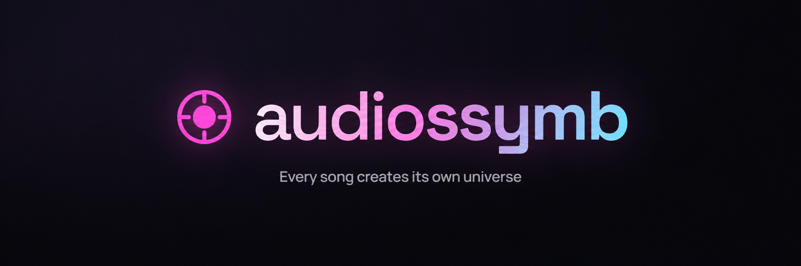
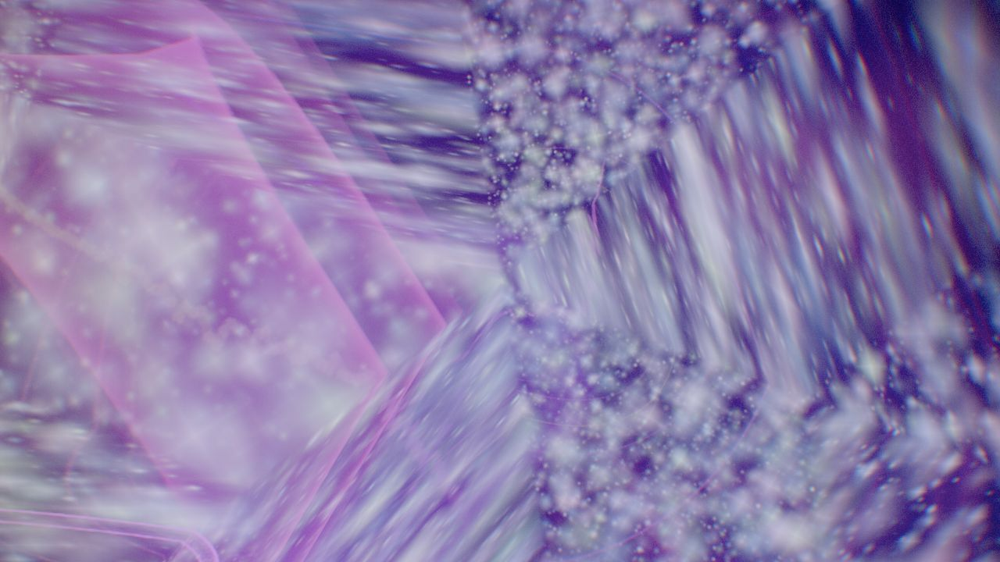

<p align="center">
  
</p>

<p align="center">
  <strong>English</strong> · <a href="README.es.md" lang="es">Español</a>
</p>

<p align="center">
  <strong>An immersive music visualizer that runs entirely in your browser.</strong><br>
  Upload a song or connect Spotify and watch sound become light, color, and shape.
</p>

<p align="center">
  
  
  
  
  
</p>

Each song can generate its own **vibe**: a seeded combination of visual layers, palette,
camera movement, and post-processing, modulated by live audio analysis. The interface
responds with the scene: colors, borders, and shadows breathe with the music.

Audio analysis and rendering happen locally. There is no application backend; Spotify
integration connects directly to Spotify. The application interface is currently in Spanish.

<p align="center">
  
</p>

<table>
  <tr>
    <td width="33%"><strong>Feel the rhythm</strong><br>Timed percussion accents, expanding particles, and light that responds to attacks.</td>
    <td width="33%"><strong>See the harmony</strong><br>Flowing ribbons, harmonic filaments, and color shaped by tonal content.</td>
    <td width="33%"><strong>Make it yours</strong><br>Thirteen layers, physical materials, album palettes, and a vibe you can save.</td>
  </tr>
</table>

<p align="center">
  <a href="#try-the-demo">Try the demo</a> ·
  <a href="#screenshots">Explore the visuals</a> ·
  <a href="#connecting-spotify">Connect Spotify</a>
</p>

## Contents

- [Getting started](#getting-started)
- [Audio sources](#audio-sources)
- [Try the demo](#try-the-demo)
- [Audio sync engine](#audio-sync-engine)
- [Visual layers](#visual-layers)
- [Materials and post-processing](#materials-and-post-processing)
- [Album artwork](#album-artwork)
- [Screenshots](#screenshots)
- [Connecting Spotify](#connecting-spotify)
- [Keyboard shortcuts](#keyboard-shortcuts)
- [Settings](#settings)
- [Persistent vibes](#persistent-vibes)
- [Architecture](#architecture)
- [Testing](#testing)
- [Requirements](#requirements)
- [Contributing](#contributing)
- [License](#license)

## Getting started

```bash
git clone https://github.com/alenj0x1/audiossymb.git
cd audiossymb
npm install
npm run dev
```

Open **http://127.0.0.1:5173/**. Use this loopback IP for the Spotify callback configuration.

```bash
npm run build     # production bundle in dist/
npm run preview   # serve the production bundle
```

## Try the demo

After starting the app locally:

1. Choose **Probar con una pista generada** on the start screen. No file or account needed.
2. Press `H` to let the visuals fill the view, and `R` to explore another vibe.
3. Press `V` to mix layers, or `G` to inspect the **Audio sync** meters as the track plays.
4. Drop in your own track to hear and see how a different arrangement changes the response.

<p align="center">
  
  <br><em>A real frame from the generated-track demo. Movement and color evolve with the sound.</em>
</p>

## Audio sources

| Source | How to connect | Analysis |
| --- | --- | --- |
| **Audio file** | Upload or drop an MP3/WAV/FLAC/OGG/M4A into the window | Live analysis of decoded audio |
| **System audio** | Loopback recording device, or screen sharing with audio | Live analysis |
| **Microphone** | Grant microphone access | Live analysis |
| **Spotify** | Premium account and Client ID | Metadata, artwork, and controls; see [real audio capture](#making-the-visuals-follow-spotify-audio) |
| **Generated track** | Link at the bottom of the start screen | Live analysis of an in-browser synthesizer |

Without an audio source, an ambient animation keeps the scene alive. It is not measured
music and does not report a measured BPM. With a live source attached, silence and pauses
let the actual audio features decay instead of replacing them with synthetic beats.

## Audio sync engine

The analysis has two complementary paths:

- **Sample-clock transients:** an `AudioWorklet` analyzes independent stereo channels in
  roughly 8 ms windows. Adaptive detectors estimate kick, snare, and hi-hat attacks, with
  timestamps, strength, and confidence. Analysis continues independently of rendering FPS.
- **Spectral context:** a 4096-point FFT (about 11.7 Hz per bin at 48 kHz) provides 64
  logarithmic bands, peaks, broad frequency regions, brightness, flatness, crest factor,
  a 12-class chromagram, harmonicity, and stereo information.

A bounded event queue aligns impacts with the playback clock, merges duplicate stereo
attacks, and discards stale events. Source changes, pauses, seeks, and Spotify track changes
reset analysis so old beats do not carry into a new passage. When AudioWorklet is unavailable,
the engine falls back to frame-based analysis.

Tempo is confidence-gated. Harmonic, sustained, plucked, percussive, and energetic or gentle
character estimates guide the visual director: impacts trigger accents while tonal content
shapes continuous movement. **These are signal-based estimates, not trained instrument,
genre, or emotion recognition.** Dense electronic music can still produce uncertain tempo.

The **Audio sync** card under **Ajustes → Visual** exposes these estimates. See the
[technical notes](docs/audio-sync.md) and [Spotify listening tests](docs/spotify-listening-tests.md)
for measurements and limitations; those notes are in Spanish.

## Visual layers

A vibe combines an atmospheric background with a selection of complementary layers,
avoiding multiple expensive layers at once. Toggle individual layers in **Vibra → Capas**.

| Layer | Behavior |
| --- | --- |
| **Sculpture** | A deforming centerpiece with physical glass, chrome, iridescent, or liquid-metal materials |
| **Nebula** | A full-screen field of warped simplex noise, caustics, rays, and stardust |
| **Auroras** | Light curtains responding to different spectral regions |
| **Metashapes** | Softly merging distance-field volumes rendered with raymarching |
| **Flow field** | Thousands of particles drifting through a 3D noise field |
| **Particles** | Band-linked dust that flashes at peaks and expands on kicks |
| **Rings** | A radial spectrum with thick gradient strokes and reflected counterparts |
| **Ribbons** | Waveforms twisting through space |
| **Tunnel** | Rings advancing toward the camera, each responding to its frequency band |
| **Surface** | Large meshes with outward spectral waves and procedural grids |
| **Orbs** | Soft, bokeh-like spheres floating through the scene |
| **Shapes** | Beat-triggered geometry with Fresnel shading and halos |
| **Resonance** | Pooled, timestamped impact accents and twelve harmonic filaments |

The visual director distributes percussive accents and sustained motion across layers.
Four camera personalities—orbit, drift, forward travel, and spiral—respond to the music
while keeping the centerpiece framed.

## Materials and post-processing

The atmosphere uses additive light, while the centerpiece uses physical surface properties.
A procedural HDR studio built from the palette supplies a sky gradient, horizon, and three
rectangular softboxes. `PMREMGenerator` turns it into an environment map for reflections.
AgX tone mapping helps preserve color in bright highlights.

```text
scene → finite HDR guard + highlight compression → trails → bloom → image grade → output
```

The HDR guard removes invalid values before bloom can spread them across the frame.
Highlight compression scales channels proportionally to preserve hue when additive layers
overlap. The final pass adds optional kaleidoscope symmetry, radial chromatic aberration,
color bleed, saturation, contrast, vignette, grain, and smoothing.

See the [blackout regression notes](docs/render-blackout.md) for the GPU reproduction and fix.

## Album artwork

With **Efectos desde la portada** enabled, artwork influences four parts of the scene:

- Dominant colors become the palette.
- Warped artwork colors flow through the background.
- Particles, flow, and orbs sample artwork by spatial position.
- The HDR environment makes the sculpture reflect the album colors.

Click the player thumbnail to expand the cover with a shared-element transition, extracted
palette, and cursor-following tilt. Close it with `Esc`, the close button, or the backdrop.

## Screenshots

From a full-screen light sculpture to the controls behind it. Click any image to inspect it
at full size. Interface labels in these real application captures are in Spanish.

<table>
  <tr>
    <td width="50%"></td>
    <td width="50%"></td>
  </tr>
  <tr>
    <td align="center"><em>Choose an audio source</em></td>
    <td align="center"><em>Sculpture and live player spectrum</em></td>
  </tr>
  <tr>
    <td></td>
    <td></td>
  </tr>
  <tr>
    <td align="center"><em>Toggle layers during playback</em></td>
    <td align="center"><em>Live audio analysis</em></td>
  </tr>
  <tr>
    <td colspan="2"></td>
  </tr>
  <tr>
    <td colspan="2" align="center"><em>Quality, sensitivity, intensity, trails, and grain</em></td>
  </tr>
</table>

## Connecting Spotify

1. Create an app in the [Spotify developer dashboard](https://developer.spotify.com/dashboard).
2. Add `http://127.0.0.1:5173/callback` to **Redirect URIs**.
3. Select **Web API** and **Web Playback SDK**.
4. Copy the **Client ID** into **Ajustes → Spotify → Guardar**.
5. Click **Conectar Spotify** and authorize access.

If you serve the app on another port, register the matching callback URI.
Authentication uses **Authorization Code with PKCE** in the browser, without a client secret
or application backend. Tokens are stored in your browser's `localStorage`.

The app displays track title, artist, artwork, progress, and controls for Spotify playback,
with a palette derived from each album cover.

### Making the visuals follow Spotify audio

The integration supports three analysis routes:

1. **Spotify audio analysis**, when the API grants access. Precomputed beats, bars, sections,
   loudness, pitch, and timbre are mapped to visual features by `src/audio/timeline.js`.
   The source indicator reads **Spotify · sincronizado**. Endpoint access is restricted;
   if it is unavailable, use real audio capture.
2. **A loopback recording device**, such as Stereo Mix or a virtual audio cable. Use
   **Buscar** in **Ajustes → Spotify**. A saved device can reconnect when browser permissions
   allow it. On Windows, look under Sound → Recording → Show disabled devices → Stereo Mix.
3. **Screen sharing with audio**. Choose a screen or supported tab and enable audio sharing.
   This permission needs to be granted again for a new capture session.

Protected Web Playback SDK audio cannot be routed directly into the Web Audio analyzer.
Playing Spotify in the same tab does not remove the need for a supported capture route.

## Keyboard shortcuts

| Key | Action |
| --- | --- |
| `Space` | Play / pause |
| `R` | New vibe |
| `P` | New palette |
| `V` | Vibe panel |
| `G` | Visual settings |
| `F` | Full screen |
| `H` | Hide / show interface |
| `Esc` | Close panels |
| Drag and drop | Load an audio file |

Automatic interface hiding applies in full screen after a period without mouse movement.

## Settings

- **Quality:** low, medium, or high; controls resolution, particles, bloom, sculpture
  subdivisions, and raymarch steps. Low quality replaces glass with a metallic material.
- **Sensitivity:** how strongly audio levels affect the visuals.
- **Visual intensity:** overall brightness, shaking, and deformation.
- **Trails and grain:** multipliers over the current vibe's settings.
- **Kaleidoscope:** allow radial symmetry.
- **Color from harmony:** estimated pitch shifts the palette hue.
- **Palette and effects from artwork.**
- **Hide interface in full screen.**
- **Vibe change card:** announce each new scene's name.
- **New vibe per track:** disabled by default so your chosen scene persists.
- **New vibe per section:** regenerate when the estimated musical character changes.

## Persistent vibes

Your last generated or edited vibe—including palette and layer toggles—is saved for your
next visit. All parameters are serialized, rather than only the seed: generation takes
different random branches depending on musical character, so a seed alone cannot reliably
restore the same scene under different audio conditions.

## Architecture

```text
src/
  audio/
    engine.js          AudioContext, sources, analyzers, and output-clock mapping
    features.js        Spectrum, chromagram, stereo, and musical context
    sync-dsp.js        Sample-based adaptive transient detection
    sync-worklet.js    Stereo analysis outside the rendering loop
    sync.js            Event queue, timing, envelopes, and character estimates
    timeline.js        Precomputed Spotify analysis mapped to visual features
    demo.js            Synthesized test track
  visual/
    director.js        Musical roles and layer modulation
    vibe.js            Seeded scene personality generation
    palette.js         Color schemes, artwork analysis, and transitions
    artwork.js         Artwork textures and spatial color sampling
    environment.js     Procedural HDR studio and PMREM
    fatline.js         Thick gradient lines
    grade.js           Finite HDR protection, highlight compression, and grading
    seed.js            Deterministic random generator
    renderer.js        Scene, cameras, and post-processing
    layers/            Thirteen visual layers, including resonance.js
  spotify/
    auth.js            Authorization Code with PKCE
    api.js             Playback state, controls, and audio analysis
    player.js          Web Playback SDK
    discontinuity.js   Track, playback, and seek discontinuity detection
  ui/hud.js            Player, analysis, artwork, notifications, and settings
  main.js              Application orchestration
```

## Testing

```bash
npm test
npm run build
```

The automated suite covers audio sync, stereo transients, visual direction, and Spotify
transport discontinuities. With `npm run dev` running, browser labs are available at:

- [Audio lab](http://127.0.0.1:5173/tests/audio-lab.html): synthetic rhythms, sustained chords,
  and anti-phase stereo at different rendering frame rates.
- [Render safety lab](http://127.0.0.1:5173/tests/render-safety.html): invalid HDR input and
  shader regressions through the bloom pipeline.

Manual observations and their limitations are documented in [audio sync](docs/audio-sync.md),
[Spotify listening tests](docs/spotify-listening-tests.md), and
[render safety](docs/render-blackout.md).

## Requirements

- A recent **Chrome or Edge** with WebGL2 and Web Audio. System capture requires browser
  support for audio sharing; Spotify web playback also needs supported protected media.
- **Node.js 18+** for the development server.
- **Spotify Premium** for Spotify integration. Other audio sources work without an account.

## Contributing

The README is available in **English** and [**Spanish**](README.es.md). Keep both versions
updated when documenting features. Most code comments are in Spanish; identifiers, Git
history, issues, and pull requests use English. See [CONTRIBUTING.md](CONTRIBUTING.md) for
commit conventions and verification steps.

## License

[MIT](LICENSE).
