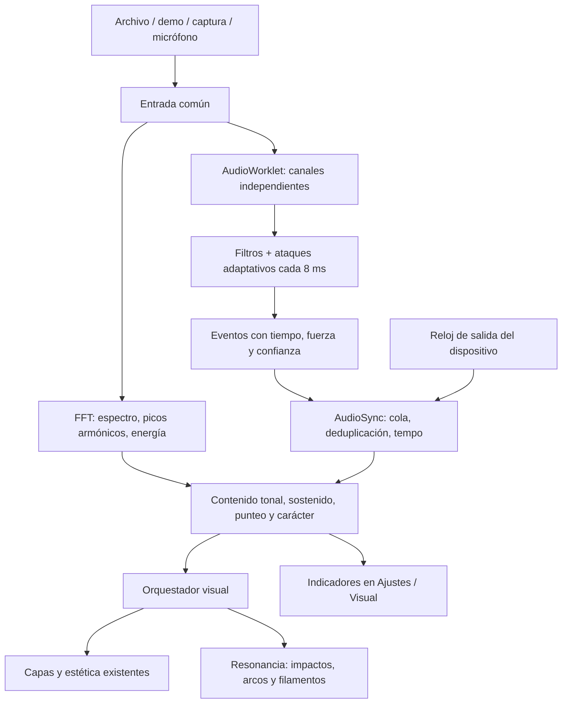

# Audio sync

## Recorrido anterior

Archivo, demo, micrófono o captura → `AudioEngine.input` → FFT mono de 4096 muestras → `FeatureExtractor.update()` en cada `requestAnimationFrame` → `Visualizer` → capas Three.js → compresión de luces, estelas, bloom y acabado.

Había 64 bandas con ganancia automática, flujo espectral para bombo/caja/agudos, cromagrama, tempo por intervalos de bombo y ánimo suavizado. Las capas recibían el mismo objeto de características; la vibra elegía geometrías, paleta, cámara y capas. Spotify podía entregar una línea temporal de segmentos y pulsos; sin análisis se usaba una animación ambiental.

Limitaciones encontradas: el reloj del detector acumulaba el delta del render (recortado a 50 ms); se perdían ataques entre cuadros; los bytes logarítmicos del analizador se trataban como magnitudes para la armonía; la anchura estéreo se confundía con la diferencia de volumen; el modo ambiental mostraba un BPM que no correspondía a música medida.

## Recorrido nuevo

`sync-dsp.js` contiene el detector independiente del navegador y se prueba con PCM generado. `sync-worklet.js` ejecuta ese detector en el hilo de audio; su salida es silencio y no duplica la reproducción ni reenvía capturas al altavoz. `sync.js` mantiene la cola y el contexto musical. Si AudioWorklet no está disponible, continúa el análisis espectral anterior y la interfaz muestra el modo de respaldo.

El reloj de salida usa `getOutputTimestamp()` en archivos/demo. En capturas se usa el reloj de llegada: no conocemos la latencia anterior del dispositivo o de la aplicación capturada. Una ventana de 8 ms es la cadencia del detector, **no** una promesa de latencia total de 8 ms. Véase la [especificación Web Audio](https://webaudio.github.io/web-audio-api/#dom-audiocontext-getoutputtimestamp).

La cola espera los eventos futuros, une duplicados estéreo y descarta impactos atrasados más de 150 ms. Cada cambio de fuente, pausa o salto reinicia el estado mediante una generación; mensajes anteriores quedan invalidados. La confianza del tempo cae cuando deja de haber ataques. El BPM ambiental ya no se presenta como tempo medido.

## Traducción musical

| Evidencia | Respuesta |
| --- | --- |
| Ataque grave compatible con bombo | Onda expansiva de corta duración y acento de cámara |
| Ataque medio compatible con caja | Arco fragmentado breve |
| Ataque agudo | Destello periférico más corto |
| Picos armónicos y cromagrama | Doce filamentos con intensidad por clase de altura |
| Contenido tonal sostenido | Apertura y continuidad de los filamentos |
| Contenido tonal con ataque | Modulación de punteo |
| Pasaje delicado | Cámara más suave |

Resonancia usa un conjunto fijo de 18 impactos y 12 filamentos, no crea geometrías por golpe, respeta el selector de capas y libera sus recursos al cambiar la vibra/calidad.

## Alcance y límites

Los nombres bombo, caja, agudos y punteo expresan firmas acústicas estimadas. No hay separación de stems ni un clasificador entrenado: un bajo con ataque puede parecer un bombo; una cuerda pulsada puede ser guitarra, piano o sintetizador. Jazz y reguetón son géneros, no regiones de frecuencia. El carácter intenso/delicado/melódico describe la respuesta visual, no una emoción o un género reconocido con certeza. Para identificación semántica fiable haría falta incorporar y validar un modelo con un corpus etiquetado, además de evaluar su coste y latencia.

La FFT armónica sigue actualizándose con el render y conserva su ventana de 4096 muestras; solo la detección de ataques se ha desacoplado por completo. El reloj de audio no elimina el límite de refresco de la pantalla. El análisis de Spotify continúa siendo una interpretación de metadatos, no detección de instrumentos desde audio real.

El director musical asigna funciones distintas a las capas: nebulosa/auroras/líquido siguen el sostenido con ataques atenuados; partículas/flujo/orbes responden al detalle percusivo; cintas/terreno dan más peso a la armonía. Los impactos de Resonancia usan su timestamp para calcular su edad, incluso cuando el render se ralentiza.

## Verificación reproducible

- `npm test`: PCM a 44,1/48 kHz, silencio, tono sostenido, separación de ataques graves/medios/agudos, invariancia por tamaño de bloque, tempo y pérdida de confianza, cola con salida diferida, mensajes antiguos, pausa, canal derecho silencioso y límites de FFT a 16 kHz.
- `npm run build`: incluye el módulo de AudioWorklet como asset independiente sin imports pendientes.
- Con `npm run dev`, abrir `/tests/audio-lab.html`: genera archivos WAV locales de percusión a 120 BPM, acorde sostenido y audio estéreo en contrafase. Reproduce por el mismo `AudioEngine` y `Visualizer`. Permite comparar render a 60/30/15 FPS y pausar. La cifra de error temporal es aproximada porque compara tiempo de media con reloj del grafo; no mide latencia acústica física.
- En la aplicación, demo → Ajustes → Visual muestra modo de análisis, carácter y seis indicadores. Vibra permite activar/desactivar Resonancia.

Las pruebas sintéticas comprueban regresiones concretas; no constituyen una evaluación de precisión sobre canciones comerciales o instrumentos aislados reales.

### Resultados observados en navegador

- WAV rítmico de 12 s, golpes entre 0,5 y 10 s: 19/19 bombos, tempo 120 BPM; error temporal aproximado medio 5,7 ms en el reloj del archivo/grafo.
- WAV de bombos estéreo en contrafase, render limitado a 15 FPS (14,4 observados): 19/19 bombos, cero cajas y agudos; error aproximado medio 5,5 ms.
- Acorde sostenido a 30 FPS: cero ataques a los 4,12 s; contenido tonal 0,88, sostenido 0,87 y carácter delicado. Estas cifras son descriptores del algoritmo, no probabilidades calibradas.
- Demo de la aplicación, cambios de calidad baja/alta: sin errores de consola observados; panel de Audio sync activo.
